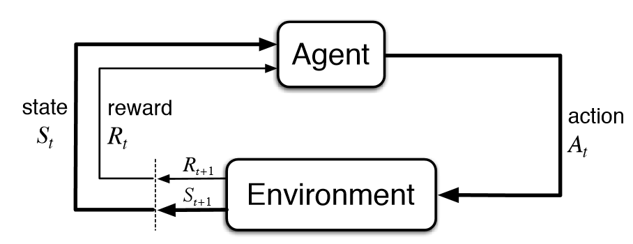
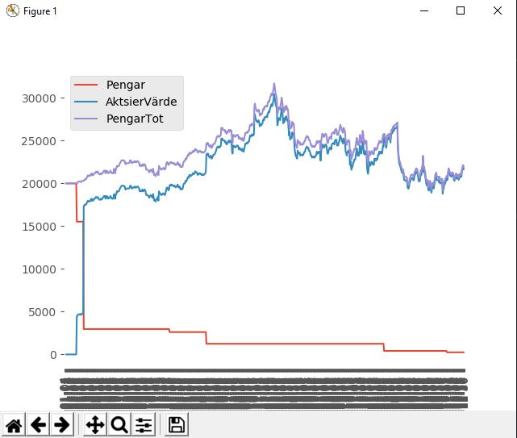
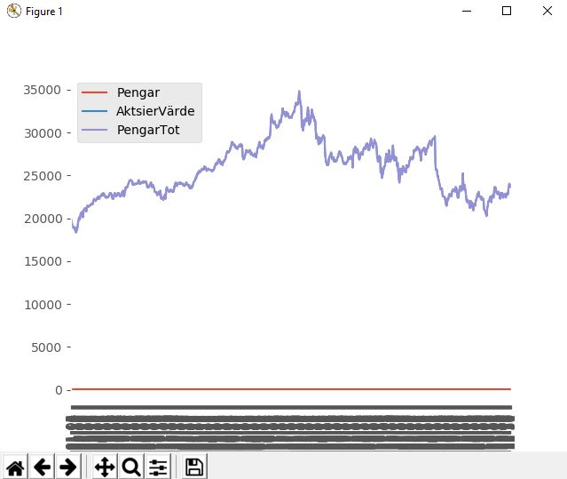

# Market-environment

## Uppgift
Detta är en fortsättning av mitt [Förra Projekt](https://github.com/abbsimoga/Enstaka-programerings-projekt/tree/master/Enstaka_programering/StockMarket).

I denna fortsättning använde jag mig utav bibloteket **_OpenAI gym_** för att skapa mitt egna *enviornment* samt *agent*. Med bakgrundskunskaper från **_Hands-On Q-Learning with Python_** och praktiska kunskaper där jag skulle intregrera **_Q-Lerning_** till tre redan skapade gym [*Taxi*, *CartPole* och *Bandit*](https://colab.research.google.com/drive/1SvR4zw3NDKJeBPpvlGZFbAgfKw7yoaIt#scrollTo=RfQiX2gThCDT).

Arbetet började med skapandet av ett eget *Tic Tac Toe* [gym](https://github.com/abbsimoga/ReinforcementLearning/tree/master/Basic_Tic_Tac_Toe_Environment) på grund av arbetets komplexitet. [Här](https://medium.com/@apoddar573/making-your-own-custom-environment-in-gym-c3b65ff8cdaa) är Medium länken jag följde för skapandet av *Tic Tac Toe* gymmet. Större del av detta arbetet följde min förra kod och exemplerna ovan men även dessa Medium länkar: [länk 1](https://towardsdatascience.com/creating-a-custom-openai-gym-environment-for-stock-trading-be532be3910e), [länk 2](https://towardsdatascience.com/cartpole-introduction-to-reinforcement-learning-ed0eb5b58288), [länk3](https://towardsdatascience.com/trade-smarter-w-reinforcement-learning-a5e91163f315) samt [länk 4](https://towardsdatascience.com/using-reinforcement-learning-to-trade-bitcoin-for-massive-profit-b69d0e8f583b).

# Förklarning av Q-Learning
Jag kommer härdan över nämna några ord som **_agent_**, **_enviornment_**, **_state_** med mera. Och ska försöka ge dig enkla förklarningar för vad dessa betyder. Samt ge dig en generell förståelse över hur RL-algorythmer funkar speciellt Q-Learning.

### RL-algorythmer och Q-Learning
**Reinforcement Learning** är en typ av maskininlärnings metod där en **_agent_** får **_rewards_** av sinna förra **_actions_** i ett **_environment_**.

### Environment & Agent
**_Environment_** är själva miljön som **_agenten_** agerar på. För spelet *Tic Tac Toe* är miljön "spel planen". För problemet *Taxi* är miljön "parkeringen". Och för detta *Market-environment* är miljön en "aktie". **_Environment_** skickar en **_state_** till **_agenten_** som med dess **_policy_** ska kunna ta en **_action_** baserad på vad det är för **_state_**. Sedan skickar **_environment_** det nästa **_state_** och en **_reward_** till **_agenten_** som används för att uppdatera **_policy_**. Denna loop avslutas när **_environment_** skickar en bool *Done*.

#### State, Action, Reward, Policy
**_Action_** är alla möjliga drag som **_agenten_** kan ta.

**_State_** är den nuvarande tillståndet som retunerades av **_environment_**.

**_Reward_** är en utvärdering av **_agentens_** förra **_action_**.

**_Policy_** är strategin som **_agenten_** använder för att bestämma nästa **_action_** baserad på det aktuella **_state_**. Typ **_agentens_** "kunskaper".

# Grafer

### Avläsande av grafer
**_Gröna_** och **_röda_** markörer tyder på agentens gissning av *Short* och *Long* positioner. Förklarning för *Short* och *Long* finner du [Här](https://www.investor.gov/introduction-investing/investing-basics/how-stock-markets-work/stock-purchases-and-sales-long-and). **_Grön_** markör betyder att agenten gissade rätt och **_röd_** markör betyder att agenten gissade fel. Eventuella **_gula_** markörer betyder att agenten gissade nästintill optimalt.

**_Y-Axeln_** är värdet på aktsiens *["Close"]* värde, definition finner du [Här](https://www.investopedia.com/terms/c/closingprice.asp).

**_X-Axeln_** är indexen på [csv filerna](https://github.com/abbsimoga/Market-environment/tree/master/Market_environment/datasets). Ett steg i *X-Axeln* är en tidsperiod frammåt. För nerladdad data används [detta script](https://github.com/abbsimoga/Market-environment/blob/master/Data.py) där tidsperioden är i *Dygn*.

<!-- ### Bild
Kommande bild visar på en körning av [Förra projektets](https://github.com/abbsimoga/Enstaka-programerings-projekt/tree/master/Enstaka_programering/StockMarket) *"AI"* som invisterade på måfå och visade tillväxt och tillbakagång på ca **+-5%**. Exact värde för denna körning = 21772/20000 = **1.0886**.
 -->

<!-- ### Bild
Kommande bild visar på att invistering i aktsier *innom* **_sp500_** leder till *tillväxt* under **längre invisteringar**. Exact värde för **_engångsinvistering_** = 23625/20000 = **1.18125**
 -->

<!-- #### **_Slutsats2:1_** Jämförs dessa två *agenter* finner vi en tydlig förbättring vid användning av Q-Learning/RL-algorythmer.

#### **_Slutsats2:2_** Invistering i aktsier *innom* **_sp500_** leder till *tillväxt* under **_längre invisteringar_** betydligt bättre än min **_första_** agent men inte bättre än den **_nya_** som använder sig av Q-Learning ett typ av RL-algorythm.

## Framtida projekt

#### Använd flera aktsiers data för att minska förlusten vid stora dropp.
#### Göra fler tester av andra "policy" och "modell's"
#### Använd annan typ av RL-algorythm
#### Interigera andra mlp  -->

<!-- AI PROJECT

TICTACTOE
skapar q-table med possible spelplaner en player random, en player q-learning

MARKET ENVIRONMENT

använd all data de senaste fem dagarna från olika aktsier för att veta

den bästa action i n^3 utförs

testa alla med data den aldrig sett för att se om några funkar

rena upp och uppdatera readme där du går igenom hur du gjorde projektet  -->