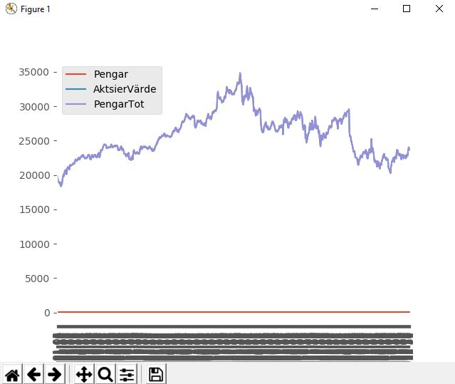

# Market-environment

Detta är en fortsättning av mitt förra projekt (https://github.com/abbsimoga/Enstaka-programerings-projekt/tree/master/Enstaka programering/StockMarket)

I denna fortsättning använde jag mig utav bibloteket OpenAI gym för att skapa mitt egna enviornment. Med kunskaper från 'Hands-On Q-Learningwith Python' där jag innan använde mig utav tre redan skapade gym

För att läsa av graferna:
    De första 450 värderna som inte är markerade är 'observation'
    De markerade värderna tyder på 'agents'

Tydlig visning på 'agentens' observation av marknadens flöde
När observationen liknar framtida 'states' kan 'agenten' använda det till sin vinst

mönster

Tydlig visning på när 'agentens' observation inte håller sig konsistant
När observationen tyder på tillväxt kommer agenten skapa en 123 

exempel2:

Agenten hittar lätt mönster på tydlig tillväxt och tillbakagång och lär sig att gissning på 

Medelvärde av tio itterationer på följd = 1.2935849431816784

Förra projekt (Förra projekt (https://github.com/abbsimoga/Enstaka-programerings-projekt/tree/master/Enstaka programering/StockMarket)
) invisterade på måfå och visade tillväxt och tillbakagång på ca +-5%

21772/20000 = 1.0886

Visar på att invistering på aktsier innom sp500 leder till tillväxt
23625/20000 = 1.18125
